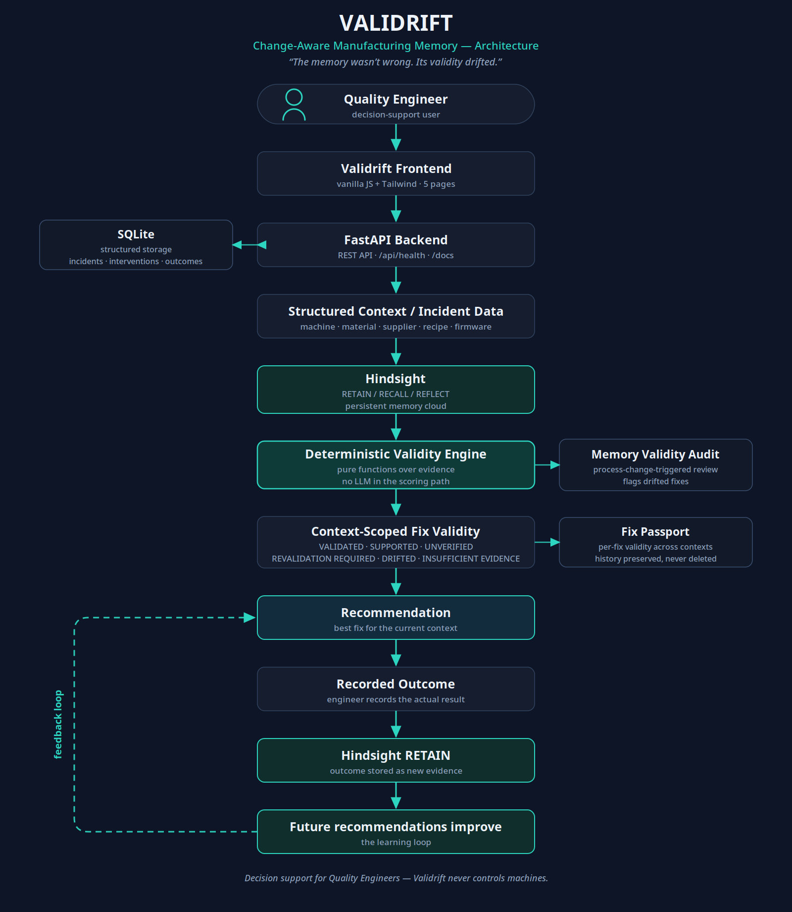

# Validrift

**Change-Aware Manufacturing Memory**

> "The memory wasn't wrong. Its validity drifted."

---

## 1. What is Validrift

Validrift is a full-stack demonstration of **context-aware manufacturing memory**: a system that remembers which fixes worked in the past — and, crucially, knows when a previously good fix should no longer be trusted because production conditions changed.

---

## 2. Problem statement

Manufacturing teams accumulate hard-won experience: which corrective actions fixed which defects on which machines. That experience is usually stored in people's heads, in chat logs, or in ticketing systems.

The danger: a fix that was genuinely correct under one set of conditions — material, supplier, recipe, firmware, machine — can **silently stop working** when the process changes. The memory isn't false. But applying it anyway leads to wrong decisions, wasted cycles, and repeated defects.

Existing tools either forget the history entirely, or remember it *too well* — recommending yesterday's fix for today's line without checking whether it still applies.

---

## 3. Solution

Validrift pairs two layers:

1. **Hindsight persistent memory** — RETAIN incidents, interventions, outcomes, and process changes; RECALL relevant past experience; REFLECT natural-language explanations of why a recommendation was made.
2. **A deterministic, context-scoped Validity Engine** — computes whether a fix is still trustworthy *in the current production context*, based on structured outcome evidence. Scores are never computed by an LLM.

The result: recommendations backed by evidence that carries its context — so an old success is preserved as history while being flagged as no longer applicable where it stopped working.

---

## 4. Why ordinary persistent memory is not enough

A conventional memory system answers: *"What worked before?"*

That's the wrong question. The right question is: *"Does it still work under today's production conditions?"*

Ordinary persistent memory returns the most similar past fix — which may be a fix that worked 4 times under Film-A / R10 but has failed twice under Film-B / R11. Without a context-validity boundary, the system confidently recommends the wrong fix. Validrift draws that boundary explicitly: every fix's status is scoped to a specific machine / material / supplier / recipe / firmware context.

---

## 5. The Film-A → Film-B example (the golden demo story)

Machine **Sealer-02**, defect **Weak Seal**:

**Old context — Film-A / PackCo / R10:**
- Fix: *Increase Temperature +5°C*
- Evidence: **4 successes / 0 failures** → **VALIDATED**

**Process change:** Film-A → Film-B, PackCo → FlexPack, R10 → R11.

**New context — Film-B / FlexPack / R11:**
- Fix: *Increase Temperature +5°C*
- Evidence: **0 successes / 2 failures** → **DRIFTED**

Crucially, Temperature +5°C remains **VALIDATED** under Film-A / R10 *while simultaneously* being **DRIFTED** under Film-B / R11. Historical knowledge is never deleted — it is re-scoped.

**New fix — Film-B / R11:** *Increase Pressure +8%*
- Initial evidence: **2 successes / 0 failures** → **SUPPORTED**
- Validrift recommends Pressure +8% and explicitly rejects the drifted Temperature fix.
- After one more recorded successful outcome: **3 successes / 0 failures** → **VALIDATED** — the learning loop, proven.

---

## 6. Key features

- **Incident logging** — record quality incidents with full context (machine, material, supplier, recipe, firmware).
- **Evidence-backed recommendations** — every recommendation cites its current-context successes and failures, plus the fixes it rejected and why.
- **Memory Validity Audit** — triggered by process changes; re-checks every known fix against the new context and reports what remains supported, what needs revalidation, and what drifted.
- **Fix Passport** — per-fix history showing all contexts it has been used in, with validity status and evidence per context envelope.
- **Outcome learning** — recording a recommendation's real outcome stores it as new intervention evidence, so future recommendations genuinely improve.
- **Memory Activity** — a transparent trace of every RETAIN / RECALL / REFLECT operation, shown live in the UI; failures are reported honestly, never fabricated.

---

## 7. Hindsight integration

Validrift uses **Hindsight** as its persistent experience layer:

- **RETAIN** — incidents, interventions, process changes, recommendation outcomes, and manufacturing experience are stored as long-term memories.
- **RECALL** — before recommending, the system retrieves similar past incidents, relevant fixes, and remembered outcomes to ground its reasoning.
- **REFLECT** — higher-level natural-language explanations are generated from accumulated experience (e.g. how a fix's effectiveness changed across contexts).

**Important boundary:** Hindsight does *not* calculate Validrift's final validity status. Validity is computed exclusively by the deterministic backend engine (see §8). The LLM is used only for readable explanation where configured. If memory is unavailable, all numeric validity and evidence continue to work; the UI degrades honestly with exact fallback messages.

---

## 8. Deterministic Validity Engine

Statuses — `VALIDATED`, `SUPPORTED`, `UNVERIFIED`, `REVALIDATION REQUIRED`, `DRIFTED`, `INSUFFICIENT EVIDENCE` — are computed backend-side from structured outcome evidence in SQLite (`backend/app/services/validity_engine.py`).

- All counts come from recorded successes and failures in the current context envelope.
- The LLM never invents scores, thresholds, or statuses; reflection is explanation only.
- Configurable thresholds live in the environment (`VALIDATED_MIN_SUCCESSES`, `DRIFT_MIN_FAILURES`); defaults: 3 successes to validate, 2 failures to drift.

---

## 9. Memory Validity Audit

A process change (new material, supplier, recipe, firmware, or machine) triggers the Memory Validity Audit (`POST /api/validity-audit`, `backend/app/services/audit_service.py`):

- Re-evaluates every known fix against the **new** context.
- Reports fixes that **remain supported**, require **revalidation**, or have **drifted**.
- Optionally includes a Hindsight REFLECT explaining how a fix's effectiveness shifted across contexts.

This is the mechanism that catches "Temperature +5°C worked under Film-A but is failing under Film-B" automatically.

---

## 10. Fix Passport

The Fix Passport (`GET /api/fixes/{fix_name}/passport`, `backend/app/services/passport_service.py`) is the per-fix identity document:

- Every context envelope the fix has been used in (machine / material / supplier / recipe / firmware).
- Validity status and evidence (successes / failures) per envelope.
- Timeline of interventions and outcomes; first-learned and last-event timestamps.
- Links to source memories in Hindsight.

It is the answer to "where has this fix been tried, and where does it still hold?"

---

## 11. Outcome learning

Recording a recommendation's real outcome (`POST /api/recommendations/{id}/outcome`) does three things:

1. Stores the outcome as new **intervention evidence** in the structured ledger.
2. RETAINs the outcome into Hindsight persistent memory.
3. Feeds the deterministic engine — e.g. Pressure +8% moves from **SUPPORTED (2/0)** to **VALIDATED (3/0)** after one more success.

The learning loop is closed and observable: no silent retraining, no hidden state.

---

## 12. Architecture



Flow:

```
Quality Engineer
      ↓
Validrift Frontend (5 pages, one centralized API client)
      ↓
FastAPI Backend
      ↓
Structured Context / Incident Data (SQLite)
      ↓
Hindsight — RETAIN / RECALL / REFLECT (persistent memory)
      ↓
Deterministic Validity Engine (statuses from evidence)
      ↓
Context-Scoped Fix Validity
      ↓
Recommendation (+ rejected alternatives with reasons)
      ↓
Recorded Outcome
      ↓
Hindsight RETAIN → future recommendations improve
```

Also included: **Memory Validity Audit** (process-change-triggered re-check) and **Fix Passport** (per-fix cross-context history). SQLite holds the structured ledger; Hindsight holds the experience memory.

Validrift is decision support: it recommends and explains. It never drives equipment or changes machine settings.

---

## 13. Screenshots

Screenshots live in [`docs/screenshots/`](docs/screenshots/) and are captured at demo time against the running application (see `SCREENSHOT_CHECKLIST.md` in the repo root for the exact capture sequence). They are not fabricated mockups.

---

## 14. API overview

Base URL: `http://127.0.0.1:8000/api`. Interactive docs: `http://127.0.0.1:8000/docs`.

| Method & route | Purpose |
|---|---|
| `GET /api/health` | Backend, database, and Hindsight connectivity status |
| `GET /api/dashboard` | KPIs, attention items, incident ledger, memory panel |
| `GET /api/process-context` | Current production context (machine / material / supplier / recipe / firmware) |
| `GET /api/incidents` / `POST /api/incidents` | List / log quality incidents |
| `POST /api/interventions` | Record a corrective action taken |
| `POST /api/process-changes` | Register a process change (triggers audit thinking) |
| `POST /api/validity-audit` | Run the Memory Validity Audit |
| `POST /api/recommend` | Get an evidence-backed recommendation for an incident |
| `GET /api/recommendations/latest` / `/{id}` | Read recommendations |
| `POST /api/recommendations/{id}/outcome` | Record the real outcome (closes the learning loop) |
| `GET /api/fixes/{fix_name}/passport` | Fix Passport |
| `GET /api/memory-activity` | Trace of RETAIN / RECALL / REFLECT operations |
| `POST /api/admin/sync-hindsight` | Push the structured ledger into Hindsight (dev) |
| `POST /api/admin/reset-demo` | Reset to the golden baseline (dev only; disabled in production) |

The frontend talks to the backend exclusively through one centralized client: `frontend/js/api.js`.

---

## 15. Tech stack

- **Frontend:** vanilla JavaScript, Tailwind CSS (CDN), 5 standalone pages, single centralized API client.
- **Backend:** Python 3.11+, FastAPI, SQLAlchemy 2, Pydantic 2, SQLite.
- **Memory:** Hindsight Cloud API (`hindsight-client` SDK) — RETAIN / RECALL / REFLECT.
- **Tests:** pytest.

---

## 16. Setup instructions

**1. Backend** (needs Python 3.11+):

```bash
cd backend
cp ../.env.example .env        # then set HINDSIGHT_API_KEY (see §17)
python -m venv .venv
source .venv/bin/activate      # Windows: .venv\Scripts\activate
pip install -r requirements.txt
uvicorn app.main:app --host 127.0.0.1 --port 8000
```

Windows: double-click `backend\run_backend.bat` (creates the venv, installs, seeds, starts).

**2. Frontend** — serve the folder over HTTP (pages call the API, so `file://` won't work):

```bash
cd frontend
python -m http.server 8080
```

Open `http://127.0.0.1:8080/index.html`.

To point the frontend at a different backend: append `?api=http://host:8000/api` or set `localStorage.validrift_api_base`.

---

## 17. Environment variables

Copy `.env.example` to `backend/.env` and fill in secrets. **Never commit `backend/.env`.**

| Variable | Purpose | Default |
|---|---|---|
| `APP_ENV` | `development` / `production` (disables demo reset in production) | `development` |
| `DATABASE_URL` | SQLAlchemy URL | `sqlite:///./validrift.db` |
| `CORS_ORIGINS` | Allowed frontend origins | `http://localhost:8080,http://127.0.0.1:8080` |
| `SEED_DEMO` | Seed the golden baseline on first start | `true` |
| `HINDSIGHT_MODE` | `live` / `disabled` | `live` |
| `HINDSIGHT_API_URL` | Hindsight Cloud endpoint | `https://api.hindsight.vectorize.io` |
| `HINDSIGHT_API_KEY` | **Your Hindsight API key (secret — never commit)** | — |
| `HINDSIGHT_BANK_ID` | Memory bank id | `validrift-demo` |
| `HINDSIGHT_RECALL_BUDGET` / `HINDSIGHT_RECALL_MAX_TOKENS` / `HINDSIGHT_TIMEOUT_SECONDS` | Recall tuning | `mid` / `2500` / `60` |
| `VALIDATED_MIN_SUCCESSES` | Successes needed for VALIDATED | `3` |
| `DRIFT_MIN_FAILURES` | Failures that mark DRIFTED | `2` |

Without a key the backend still runs: numeric validity is 100% deterministic and backend-side; memory calls degrade honestly — *"Memory service temporarily unavailable."* / *"Evidence is available, but natural-language explanation is temporarily unavailable."*

---

## 18. Seed / reset instructions

- On first start with `SEED_DEMO=true`, the backend seeds the **golden baseline**: the Film-A/R10 history (Temperature +5°C, 4/0, VALIDATED), the process change to Film-B/R11, and the Film-B/R11 evidence (Temperature +5°C 0/2 DRIFTED; Pressure +8% 2/0 SUPPORTED).
- Reset the demo any time (development only): Dashboard → **Reset demo data**, or `POST /api/admin/reset-demo`. The reset endpoint is disabled automatically when `APP_ENV=production`.
- Push the structured ledger into Hindsight: `POST /api/admin/sync-hindsight` (or run `backend/sync_hindsight.sh` / `.bat`). Uses stable document IDs, so re-syncing upserts rather than duplicating.

---

## 19. Tests

```bash
cd backend
.venv/bin/python -m pytest tests/ -q
```

13 tests: API tests, Validity Engine unit tests, and golden-path tests covering reset → incident → recommend → outcome → audit promotion. **13/13 passing.**

---

## 20. Verified results

Verified against the running application with the real Hindsight Cloud service (no mocks):

- Backend tests: **13/13 passing**
- Frontend: **5/5 pages** hydrated against the live backend, **zero JavaScript errors**
- Hindsight: **RETAIN PASS**, **RECALL PASS**, **REFLECT PASS** (real Hindsight Cloud, bank `validrift-demo`)
- Health: `GET /api/health` → backend ok, database ok, Hindsight **live / healthy**
- Golden recommendation: new Film-B/R11 Weak Seal incident → **Increase Pressure +8%**, **SUPPORTED (2/0)**; Temperature +5°C correctly rejected as **DRIFTED (0/2)**
- Context-specific validity: Temperature +5°C is **VALIDATED (4/0)** under Film-A/R10 and **DRIFTED (0/2)** under Film-B/R11 — history preserved, not deleted
- Learning loop: recorded successful outcome → Pressure +8% promoted to **VALIDATED (3/0)**; the outcome was RETAINed into Hindsight and appears in Memory Activity
- Degraded mode: with Hindsight disabled, deterministic validity and evidence are unaffected; exact fallback messages shown; no memory events fabricated

Full evidence: [`FINAL_VERIFICATION_REPORT.md`](FINAL_VERIFICATION_REPORT.md).

---

## 21. Limitations

- The demo ships a small seeded dataset; it is a **demonstration**, not a production MES integration.
- Real-browser pixel-level screenshots were captured at demo time (see `docs/screenshots/`); layout was additionally verified via DOM hydration checks.
- Hindsight requires a valid API key and network access; without it the system runs in degraded mode (validity still works, explanations unavailable).
- Recommendation quality depends on the quantity and honesty of recorded outcomes — the engine only knows what was logged.

---

## 22. Safe decision-support statement

**Validrift is a decision-support demonstration.** It recommends corrective actions and explains the evidence behind them for a human quality engineer to review. It does not control machines, change process parameters, or execute actions on the factory floor. All recommendations should be validated by qualified personnel before being applied in a real production environment.

---

## 23. Project structure

```
validrift-manufacturing-memory/
├── README.md
├── LICENSE
├── .env.example                 # copy to backend/.env (never commit the real one)
├── .gitignore
├── INTEGRATION_REPORT.md
├── FINAL_VERIFICATION_REPORT.md
├── docs/
│   ├── architecture.png
│   └── screenshots/             # captured at demo time
├── frontend/                    # 5 pages, vanilla JS + Tailwind
│   ├── index.html               # Dashboard
│   ├── new-incident.html        # Incident logging wizard
│   ├── recommendation.html      # Recommendation + evidence + record outcome
│   ├── validity-audit.html      # Memory Validity Audit + process-change form
│   ├── fix-passport.html        # Fix Passport
│   └── js/
│       ├── api.js               # THE single API client — all backend calls go through here
│       ├── config.js            # API base URL resolution
│       ├── common.js            # nav, toasts, chips, memory panel
│       └── *.js                 # one script per page
└── backend/
    ├── app/
    │   ├── api/routes.py        # all HTTP routes
    │   ├── core/                # config, database, enums
    │   ├── models.py / schemas.py
    │   ├── seed.py              # golden baseline seed
    │   └── services/
    │       ├── validity_engine.py      # deterministic statuses — never LLM
    │       ├── hindsight_service.py    # RETAIN / RECALL / REFLECT + honest degradation
    │       ├── recommendation_service.py
    │       ├── audit_service.py        # Memory Validity Audit
    │       ├── passport_service.py     # Fix Passport
    │       ├── dashboard_service.py
    │       └── memory_sync_service.py  # ledger → Hindsight sync
    ├── tests/                   # 13 tests incl. full golden path
    ├── requirements.txt
    ├── run_backend.sh / .bat    # one-click start
    └── sync_hindsight.sh / .bat
```

---

## 24. Team

**Team ThinkMates**

- Amrutha K
- Kammar Akshay
- Rashmika K

Built with Hindsight persistent memory. *"The memory wasn't wrong. Its validity drifted."*
